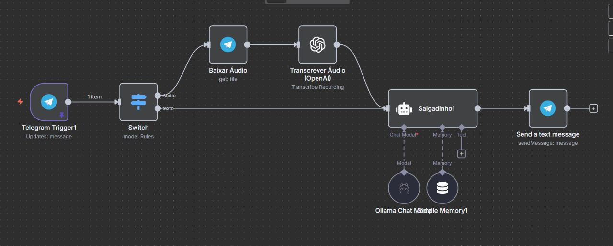
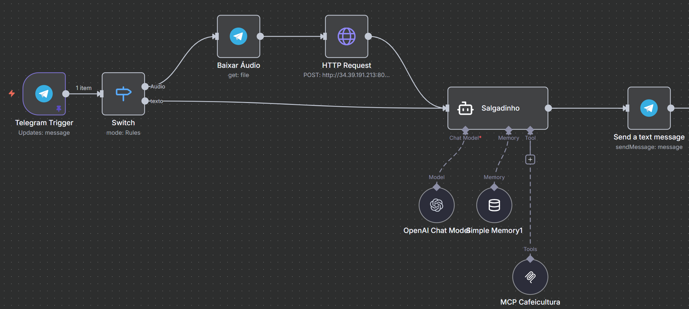
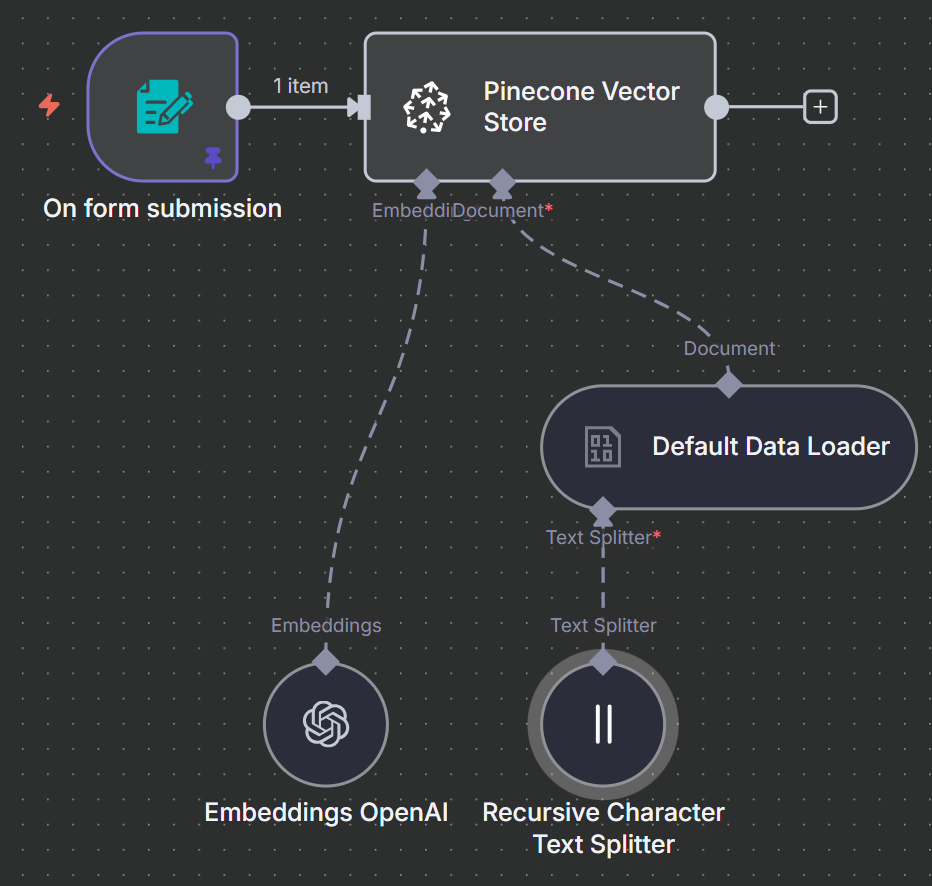
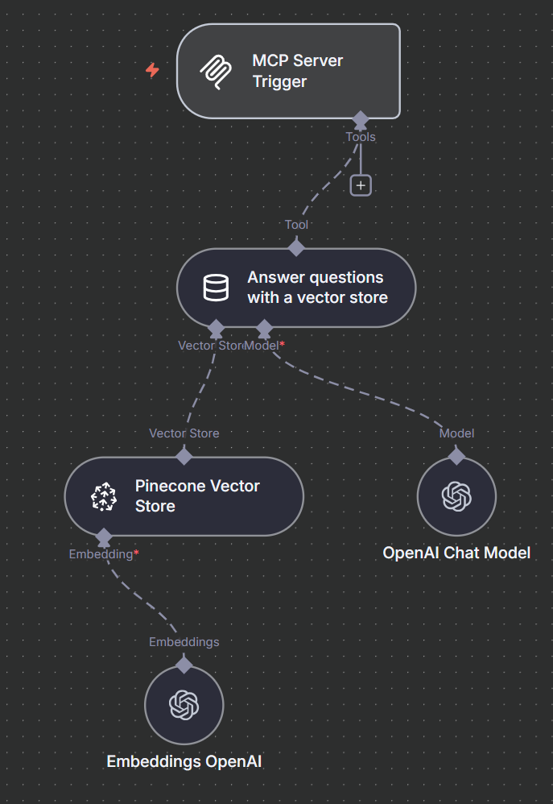

# ☕ Sistema de Suporte à Pesquisa em Cafeicultura com Inteligência Artificial

> Projeto desenvolvido para a disciplina **GCC129 – Sistemas Distribuídos** da **Universidade Federal de Lavras (UFLA)**.  
> O sistema utiliza **arquitetura distribuída**, **modelos de linguagem locais (LLM)** e **Geração Aumentada por Recuperação (RAG)** para otimizar o acesso à informação técnica sobre **cafeicultura** no **Núcleo de Estudos em Cafeicultura (NECAF / INOVACAFÉ)**.

---

## 📚 Sumário
- [📖 Introdução](#-introdução)
- [🎯 Objetivos](#-objetivos)
- [🏗️ Arquitetura do Sistema](#️-arquitetura-do-sistema)
  - [🔧 Arquitetura Orientada a Serviços (SOA)](#-arquitetura-orientada-a-serviços-soa)
  - [⚡ Arquitetura Orientada a Eventos (EDA)](#-arquitetura-orientada-a-eventos-eda)
- [🧩 Modelagem de Ameaças (STRIDE)](#-modelagem-de-ameaças-stride)
- [⚠️ Priorização de Riscos](#️-priorização-de-riscos)
- [💻 Tecnologias Utilizadas](#-tecnologias-utilizadas)
- [🚀 Execução e Estrutura do Projeto](#-execução-e-estrutura-do-projeto)
- [👥 Autores](#-autores)
- [📜 Licença](#-licença)

---

## 📖 Introdução

A **cafeicultura** é um dos pilares do agronegócio brasileiro, especialmente no **Sul de Minas Gerais**, onde a **UFLA** se destaca como referência em pesquisa e inovação.  
O **NECAF (Núcleo de Estudos em Cafeicultura)**, integrado à **Agência de Inovação do Café (INOVACAFÉ)**, gera uma grande quantidade de conhecimento técnico e científico — porém, o acesso rápido e contextualizado a esse acervo ainda é um desafio.

Para resolver isso, este projeto propõe um **assistente virtual inteligente** capaz de compreender **consultas em texto ou áudio via Telegram**, e responder com base em documentos técnicos e científicos do NECAF.

---

## 🎯 Objetivos

### Objetivo Geral
Desenvolver um sistema conversacional baseado em **Inteligência Artificial Distribuída** que otimize o acesso às informações de cafeicultura do NECAF.

### Objetivos Específicos
- Integrar o **Telegram** como interface de consulta (texto e voz);
- Implementar serviço de **transcrição de áudio** (API OpenAI ou Whisper local);
- Executar o **modelo de linguagem Whisper (Open AI)** localmente, garantindo **privacidade e soberania de dados**;
- Criar uma base **RAG (Retrieval-Augmented Generation)** com artigos e relatórios do NECAF;
- Integrar os módulos em um **fluxo distribuído e assíncrono**;
- Validar a **eficácia e precisão** das respostas do sistema.

---

## 🏗️ Arquitetura do Sistema

A arquitetura foi desenhada para ser **modular**, **resiliente** e **escalável**, combinando serviços **em nuvem** e **locais (on-premise)**.  
Dois paradigmas principais foram adotados:

### 🔧 Arquitetura Orientada a Serviços (SOA)

O sistema é composto por **serviços independentes** que se comunicam via **APIs REST**.

**Serviços Externos (Cloud):**
- **Telegram Bot API** → interface com o usuário;
- **Chat GPT** → processamento de linguagem natural.

**Serviços Internos (On-Premise):**
- **OpenAI Whisper** → trascrição de áudios;
- **Base RAG** → artigos e relatórios técnicos vetorizados.

🧱 *Benefício:* modularidade — qualquer serviço pode ser substituído sem afetar o restante do sistema.

---

### ⚡ Arquitetura Orientada a Eventos (EDA)

O sistema opera de forma **reativa e assíncrona**, respondendo a **eventos**:

1. **Evento:** o usuário envia mensagem (texto/áudio) no Telegram.  
2. **Trigger:** o backend detecta o evento (“Telegram Update”).  
3. **Reação:** aciona o fluxo de processamento:
   - Transcrição (se áudio);
   - Consulta ao LLM;
   - Geração da resposta e envio ao usuário.

💬 *Vantagem:* permite múltiplas consultas simultâneas sem bloqueios ou conexões persistentes.

---

## 🧩 Modelagem de Ameaças (STRIDE)

O sistema foi avaliado sob o modelo **STRIDE**, e as principais **15 ameaças** identificadas estão detalhadas abaixo:

| ID | Classe STRIDE | Descrição da Ameaça | Probabilidade | Impacto | Risco | Medida de Mitigação | Prob. Residual | Impacto Residual | Risco Residual |
|----|----------------|--------------------|----------------|----------|--------|----------------------|----------------|------------------|----------------|
| 1 | Spoofing | Usuário não autorizado interage com o bot e consome recursos/dados. | Alta | Médio | Alto | Whitelist de userIDs e validação de tokens. | Baixa | Médio | Médio |
| 2 | Spoofing | Atacante envia requisições forjadas para o endpoint do webhook. | Alta | Alto | Alto | Validação de assinatura/token e uso de WAF. | Baixa | Alto | Médio |
| 3 | Tampering | Alteração maliciosa da base RAG. | Médio | Alto | Alto | Controle de integridade e permissões read-only. | Baixa | Alto | Médio |
| 4 | Tampering | Injeção de prompts maliciosos para burlar a IA. | Alta | Médio | Alto | Sanitização de entrada e system prompt robusto. | Médio | Médio | Médio |
| 5 | Tampering | Modificação ou exclusão de logs do sistema. | Médio | Médio | Médio | Logs append-only e controle de acesso. | Baixa | Médio | Baixo |
| 6 | Repudiation | Usuário nega ter feito determinada consulta. | Médio | Baixo | Médio | Auditoria com userID e timestamp. | Baixa | Baixo | Baixo |
| 7 | Information Disclosure | Vazamento de áudios sensíveis para API externa. | Alta | Alto | Alto | Substituir API externa por Whisper local. | Baixa | Alto | Médio |
| 8 | Information Disclosure | Exposição de chaves de API em ambientes inseguros. | Médio | Alto | Alto | Uso de Vault/Docker Secrets e rotação de chaves. | Baixa | Alto | Médio |
| 9 | Information Disclosure | Vazamento de dados de pesquisa via container comprometido. | Médio | Alto | Alto | Criptografia e isolamento de containers. | Baixa | Alto | Médio |
| 10 | Denial of Service | Sobrecarga de consultas no Whisper que roda local. | Alta | Alto | Alto | Rate limiting e fila de processamento. | Médio | Alto | Médio |
| 11 | Denial of Service | Falha ou lentidão na API de transcrição. | Médio | Médio | Médio | Retries e circuit breaker. | Baixa | Médio | Baixo |
| 12 | Elevation of Privilege | Execução remota de código dentro do container. | Baixa | Muito Alto | Alto | Rodar como non-root e manter patches atualizados. | Muito Baixa | Alto | Médio |
| 13 | Elevation of Privilege | Acesso indevido à rede interna via container. | Médio | Alto | Alto | Segmentação de rede e isolamento de containers. | Baixa | Alto | Médio |
| 14 | Information Disclosure | Logs contendo dados sensíveis de consultas. | Médio | Médio | Médio | Mascaramento e anonimização de logs. | Baixa | Médio | Baixo |
| 15 | Tampering | Atualização não autorizada do modelo LLM. | Médio | Alto | Alto | Assinatura de imagens e controle de versionamento. | Baixa | Alto | Médio |

---

## ⚠️ Priorização de Riscos

1. 🔴 **Divulgação de Informações:** áudios e dados de pesquisa enviados a APIs externas.  
2. 🟠 **Adulteração (RAG):** integridade dos artigos é crítica para confiança.  
3. 🟡 **Prompt Injection:** risco contínuo em sistemas baseados em LLM.

---

## 💻 Tecnologias Utilizadas

| Componente | Tecnologia |
|-------------|-------------|
| Chatbot | [Telegram Bot API](https://core.telegram.org/bots/api) |
| Transcrição de Áudio | [OpenAI Whisper](https://platform.openai.com/docs/guides/speech-to-text)|
| Base de Conhecimento | RAG (vetorização + embeddings) |
| Backend | Node.js (n8n) |
| Infraestrutura | Docker Compose / Rede isolada |
| Segurança | STRIDE / Hashing / Rate Limiting |

---

## 👥 Autores

| Nome | Função |
|------|---------|
| **Caio César da Rocha** | Modelagem de Ameaças e Segurança // Desenvolvimento e Integração de serviços // OpenAI Whisper |
| **Gustavo Henrique Moraes Filho** | Modelagem de Ameaças e Segurança // Desenvolvimento e Integração de serviços // Telegram e MCP|
| **João Victor Vieira Neto Matos** | Documentação  // Desenvolvimento e Integração de serviços // ChatGPT |
| **Mateus Henrique Teixeira** | Documentação // Desenvolvimento e Integração de serviços // RAG |

📍 *Universidade Federal de Lavras (UFLA)* – 2025  
📘 Disciplina: **GCC129 – Sistemas Distribuídos**

---

## 🔄 Fluxo de Serviços (n8n)

A seguir está o diagrama do fluxo implementado no n8n, responsável por orquestrar a recepção das mensagens, transcrição e consulta ao modelo de IA.

### 🔹 Fluxo Inicial de Atendimento com resposta (Texto + Áudio)

  

### 🔹 Fluxo Final de Atendimento com resposta (Texto + Áudio)

  

### 🔹 Fluxo para inclusão de novos arquivos para a base de dados vetorial

  

### 🔹 Fluxo para consulta do RAG pelo ChatGPT

  

---

## 📜 Licença

Este projeto é de uso acadêmico e educacional, podendo ser adaptado para fins de pesquisa e extensão.

---

